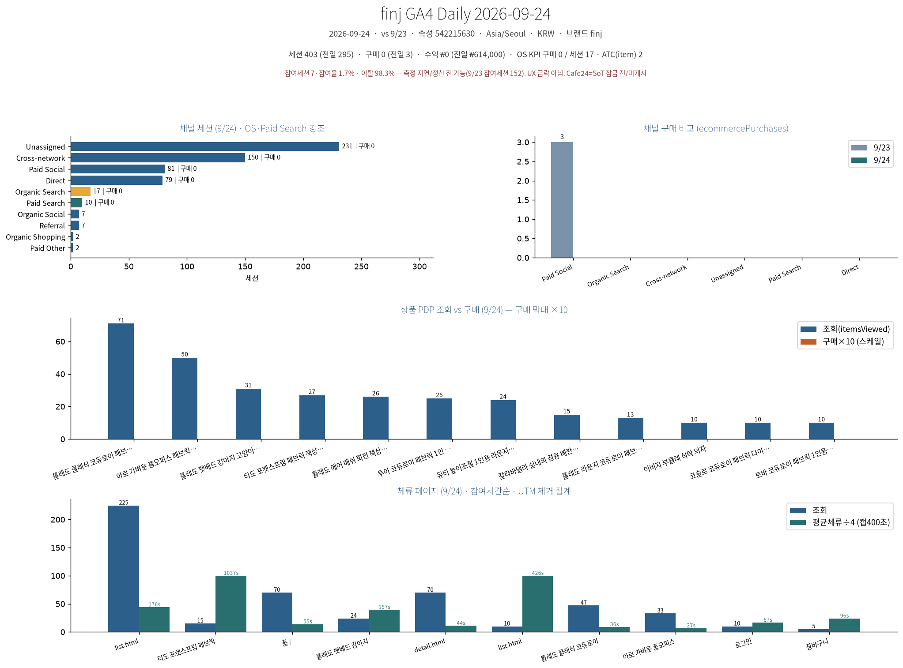

# finj GA4 Daily 2026-09-24

**날짜**: 2026-09-24 (vs 9/23)  
**속성**: 542215630  
**브랜드**: finj  
**타임존**: Asia/Seoul · KRW

---

## 📊 한눈에 (Summary)

### 주요 지표
- **세션**: 403 ↑ (전일 295)
- **사용자**: 373
- **구매**: **0 ↓** (전일 3)
- **수익**: **₩0 ↓** (전일 ₩614,000)

### KPI: Organic Search
- **세션**: 17 (전일 16)
- **구매**: **0** (전일 0)
- **수익**: **₩0** (전일 ₩0)

### 전환 지표
- **ATC(site)**: 6
- **ATC(item)**: 2
- **항목 구매합**: 0
- **항목 수익**: ₩0

### 참여율
- **참여 세션**: 7 (≈1.7%)
- **이탈률**: 98.3%
- ⚠️ **측정 지연** 추정 (전일 152/51.5% → 극적 하락은 UX 문제 아님)

---

## 📈 채널별 세션 분석

### 주요 채널 (9/24 · Paid Search 제외)

| 채널 | 세션 | 구매 | 수익 |
|------|------|------|------|
| **Unassigned** | 231 | 0 | ₩0 |
| **Cross-network** | 150 | 0 | ₩0 |
| **Paid Social** | 81 | 0 | ₩0 |
| **Direct** | 79 | 0 | ₩0 |
| **Organic Search** | 17 | 0 | ₩0 |
| **Paid Search** | 10 | 0 | ₩0 |
| **Referral** | 7 | - | - |
| **Organic Shopping** | 2 | - | - |
| **Paid Other** | 2 | - | - |

### Paid Search 상세
- **총 세션**: 10
- **naver/cpc**: 10세션
- **구매**: 0건

### Organic Search 상세
- **KPI 세션**: 17
- **전환**: 0건 (채널 구매 0)
- **google/organic**: 14세션
- **naver/organic**: 0세션
- **참고**: `m.search.naver.com/referral` 3세션은 Referral로 분류 (순수 OS 아님)

---

## 🔍 상품 PDP (Product Detail Page)

### 상품별 조회 (9/24 · 구매 제외 ×10)

| 상품명 | 조회수 | 구매 |
|--------|--------|------|
| 롤베드 쉘라 고무나무 침대 | 71 | 0 |
| 이온 가죽소파 천연가죽 | 50 | 0 |
| 롤베드 슬로우 펫베드 라탄가구 | 31 | 0 |
| 티도 부츠형시트 펫베드 | 27 | 0 |
| 롤베드 펫베드 캣워크 펫침대 | 26 | 0 |
| 투아 슬로우라이프 펫텐트 | 25 | 0 |
| 펫베드 대형견 카펫베드 | 24 | 0 |
| 투비 베이직 원목 펫침대 | 15 | 0 |
| 롤베드 시트형 고양이 펫매트 | 13 | 0 |
| 이누야마 털갈이 펫웨이브 의자 | 10 | 0 |
| 포트토 보관함 펫식탁 테이블 | 10 | 0 |
| 열비 코튼방석 펫침대 모던침대 | 10 | 0 |

---

## 📄 체류 페이지 (9/24 · 집계/시간 · LTM 제외 상위)

| 페이지 | 조회수 | 체류시간(초) |
|--------|--------|--------------|
| **list.html** | 225 | 176 |
| **티도 부츠형시트 펫베드** | 15 | 1037 |
| **홈** | 70 | 55 |
| **펫베드** | 24 | 157 |
| **detail.html** | 70 | 44 |
| **리뷰** | 10 | 426 |

---

## ⚠️ 이슈 및 주의사항

### 주요 경고

1. **참여 세션 7 (≈1.7%) · 이탈 98.3%**
   - 측정 지연으로 추정 (전일 152/51.5%)
   - UX 급락 아님

2. **Attribution/UTM 품질 이슈**
   - Unassigned: 231세션
   - (not set): 231
   - (data not available): 142

3. **Cafe24 = SoT (Source of Truth)**
   - 잠금 전/미게시 (MCP timeout)
   - **강제매칭 금지**

4. **UTM 파라미터 미검출**
   - `{{site_source_name}}` 미검출 (세션 0)

5. **측정 차이**
   - ATC(item) 2 < ATC(site) 6

---

## 📌 액션 아이템

### 우선순위별 조치사항

1. **Paid Social 81→0**
   - `ig/paid-social` 47/0
   - Meta 방향만 병기, 강제매칭 금지

2. **Unassigned 231**
   - UTM·결제 매핑 최우선

3. **OS KPI 구매 0 (세션 17)**
   - Organic Search 전환 최적화 필요

4. **파워링크**
   - 10세션 · 구매 0
   - 네이버페이 교집합 0

5. **상품별 담기 UX 우선**
   - 펫베드: 31조회/구매0
   - 투아: 25조회/구매0
   - 투아 $20 · 펫베드 $30 홀드

6. **참여세션 측정**
   - 현재 7 vs 전일 152
   - 측정 지연 확인
   - Cafe24=SoT (MCP timeout)
   - 강제매칭 금지

---

## 📸 시각화

**차트 포함 내역**:
- 채널 세션 분석 (9/24 · Q5: Paid Search 제외)
- 채널 구매 비교 (ecommercePurchases)
- 상품 PDP 조회 vs 구매 (9/24 · 구매 제외 ×10)
- 체류 페이지 (9/24 · 집계/시간 · LTM 제외 상위)

---

## 📋 메타데이터

- **데이터 소스**: GA4 MCP (verified)
- **속성 ID**: 542215630
- **비교 날짜**: vs 9/23
- **생성일**: 2026-09-24
- **보고 도구**: Cursor Agent
