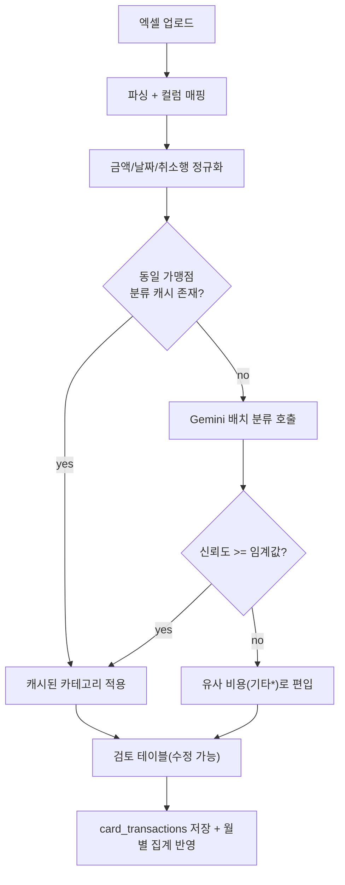

# 카드사 지출 내역 자동 분류 · 부가세 신고 기능 설계서

> 카드사 엑셀 명세서를 업로드하면 Gemini AI가 거래를 기존 비용 항목으로 자동 분류하고,
> 월별 집계에 연동하며, 가맹점 사업자등록번호를 유지해 부가세 신고 자료를 생성한다.

---

## 1. 목표

- 카드사 엑셀(여러 카드사 양식 혼재) 업로드 → 거래 라인아이템 파싱
- Gemini AI가 각 거래를 기존 비용 카테고리(고정비/변동비/광고비/매입)로 자동 분류
- 규칙/AI로 매칭되지 않는 거래는 **유사 비용**(가장 근접한 `기타*` 항목)으로 편입 + 사용자 확인
- 분류 결과를 기존 **월별 집계 데이터(`monthly_data`)** 에 자동 반영
- 가맹점 **사업자등록번호를 유지**하여 부가세(매입세액) 신고 자료 생성

---

## 2. 현재 구조 분석

- 데이터 모델은 **월별 집계값만** 저장한다. 개별 거래 내역·사업자번호는 없음.
  - `utils/database.py` → `monthly_data` 테이블 (`year_month`, `data(JSON)`, `updated_at`)
  - `DEFAULT_MONTH_DATA` 구조: `매출 / 광고비 / 고정비 / 변동비 / 매입`
- 입력은 수기(`pages/2_✏️_데이터입력.py`), 계산은 `utils/calculations.py`.
- 결론: 거래 단위 저장소와 분류 파이프라인을 **신규로 추가**하고, 집계 결과만 기존 `monthly_data`에 합산 반영하는 구조가 가장 안전(기존 대시보드/계산 로직 무변경).

### 기존 비용 카테고리 (분류 타깃)

- **광고비**: `오늘의집_광고, 자사몰_광고, 메타_광고, 네이버_광고, 기타_광고`
- **고정비**: `급여, 4대보험, 퇴직연금, 식대, 임대료, 창고료, 전기료, 관리비, 이자_하나은행, 세무사비, 솔루션구독비, 통신비, 기타고정비`
- **변동비**: `택배비, 설치배송비, 반품비, 포장재비, PG수수료, 플랫폼수수료, AS비, 불량처리비, 촬영비, 인플루언서비, 출장교통비, 접대비, 소모품비, 기타변동비`
- **매입**: `매입금액`

---

## 3. 신규 데이터 모델

### 3.1 Supabase `card_transactions` 테이블 (거래 라인아이템)

- `id` (uuid, pk)
- `year_month` (text, 예: `2026-07`) — 분류·집계 기준
- `txn_date` (date) — 거래일자
- `merchant` (text) — 가맹점명
- `biz_no` (text, nullable) — 가맹점 사업자등록번호 (부가세용, 유지)
- `card_name` (text, nullable) — 카드사/카드 구분
- `amount` (numeric) — 총 결제금액(부가세 포함)
- `supply_value` (numeric) — 공급가액 = `amount / 1.1` (반올림)
- `vat` (numeric) — 부가세 = `amount - supply_value`
- `category_group` (text) — `광고비/고정비/변동비/매입`
- `category` (text) — 세부 항목(예: `통신비`)
- `vat_deductible` (bool) — 매입세액 공제 여부(접대비 등 불공제 자동 판정)
- `classify_source` (text) — `rule / gemini / manual`
- `confidence` (numeric, nullable) — AI 신뢰도
- `raw` (jsonb) — 원본 행(감사/재분류용)
- `created_at`, `updated_at`

> 로컬 폴백: `data/card_transactions.json` (기존 `_load_local` 패턴과 동일하게 Supabase 우선 → 실패 시 로컬).

### 3.2 회사(핀즈) 사업자 정보

- `.streamlit/secrets.toml`에 `[company]` 섹션 추가(사업자등록번호/상호/대표자/업태·종목). 부가세 신고서 헤더용.

---

## 4. 엑셀 업로드 & 유연한 컬럼 매핑

여러 카드사 양식이 섞이므로 **컬럼명을 고정하지 않고 자동 감지 + 수동 매핑 UI** 제공.

- `openpyxl`/`pandas`로 시트 로드 → 헤더 후보 자동 탐색.
- 표준 필드에 대한 **동의어 사전** 기반 자동 매핑:
  - 거래일자 ← `이용일, 거래일자, 승인일자, 매출일자, date`
  - 가맹점명 ← `가맹점명, 이용가맹점, 가맹점, 상호, merchant`
  - 금액 ← `이용금액, 승인금액, 합계, 결제금액, amount`
  - 사업자번호 ← `사업자번호, 사업자등록번호, 가맹점사업자번호`
  - 카드구분 ← `카드명, 카드종류, 카드번호`
- 자동 매핑 실패 컬럼은 `st.selectbox`로 사용자가 직접 지정(매핑 프리셋을 카드사별로 저장 가능).
- 금액 파싱: 콤마/원문자/괄호(마이너스) 정규화, 취소/부분취소 행 처리(음수 합산).

---

## 5. Gemini 기반 자동 분류 파이프라인

### 5.1 처리 순서 (하이브리드가 아닌 AI 우선, 단 캐시로 비용 절감)

### 5.2 Gemini 호출 설계 (`utils/classifier.py` 신규)

- 모델: `gemini-1.5-flash`(비용/속도) — `google-generativeai` 패키지.
- API 키: `st.secrets["gemini"]["api_key"]` (하드코딩 금지, 사용자 룰 준수).
- **배치 분류**: 여러 거래를 한 번에 JSON으로 전달(토큰/호출 수 절감).
- 프롬프트에 **허용 카테고리 목록(고정)** 을 주입하고, 반드시 그 안에서만 고르도록 강제.
- 응답 스키마(JSON): `[{index, category_group, category, confidence, vat_deductible, reason}]`.
- **가맹점→카테고리 캐시**(`data/merchant_map.json` 또는 Supabase `merchant_category_map`)로 동일 가맹점 재분류 시 AI 호출 생략.
- 실패/저신뢰: `기타고정비`·`기타변동비` 중 근접 항목으로 폴백(= "유사 비용").

### 5.3 유사 비용 규칙

- `confidence < 0.6` 또는 카테고리 미매칭 → 성격 추정(정기/일회성)으로 `기타고정비` 또는 `기타변동비` 배정.
- 검토 테이블에서 배지로 "유사분류(확인 필요)" 표시 → 사용자가 드롭다운으로 교정.
- 교정 결과는 캐시에 반영되어 다음 업로드부터 정확도 상승.

---

## 6. 월별 집계 연동

- 분류 확정 후, 해당 `year_month`의 `category_group/category`별 **금액 합계**를 계산.
- 기존 `monthly_data`의 해당 월 데이터를 로드 → 카드거래 합계를 **해당 항목에 합산 또는 덮어쓰기**(모드 선택 UI 제공: "합산" / "카드분만 반영").
- `save_month_data()` 재사용 → 대시보드/계산 로직 무변경으로 즉시 반영.
- 이중 반영 방지: 월별로 "카드거래 반영분"을 별도 추적(재업로드 시 기존 반영분 롤백 후 재적용).

---

## 7. 부가세 신고 기능 (`pages/5_🧾_부가세.py` 신규)

- 대상: 신용카드매출전표 등 수령 명세(매입세액 공제분).
- 분기/월 선택 → `card_transactions`에서 `vat_deductible = true` 필터.
- **사업자등록번호별 집계표** 생성:
  - 가맹점 사업자번호 · 상호 · 건수 · 공급가액 합계 · 부가세 합계.
- 불공제 항목 자동 분리: `접대비`, (있다면)비영업용 승용차 관련 등.
- 합계 요약: 총 매입 공급가액 / 매입세액(공제) / 불공제세액.
- **내보내기**: 신고용 엑셀(`openpyxl`) 다운로드 — 국세청 "신용카드매출전표등 수령명세서" 서식에 준하는 컬럼 구성.
- 회사 사업자정보(`[company]` secrets)는 신고서 헤더에 표시.

---

## 8. UI / 페이지 구성

- **신규** `pages/4_🧾_카드내역업로드.py`
  1. 파일 업로더 → 미리보기
  2. 컬럼 매핑 UI(자동 + 수동)
  3. "AI 분류 실행" 버튼
  4. 검토·교정 테이블(`st.data_editor`) — 카테고리 드롭다운, 유사분류 배지
  5. "저장 & 월별 반영" 버튼(합산/덮어쓰기 모드)
- **신규** `pages/5_🧾_부가세.py` — 6장 참조.
- 홈(`app.py`)/대시보드: 변경 없음(집계는 기존 경로로 반영되므로 자동 표시).

---

## 9. 신규/변경 파일 목록

- 신규 `utils/classifier.py` — Gemini 배치 분류, 캐시, 유사비용 폴백.
- 신규 `utils/excel_parser.py` — 다중 카드사 파싱 + 컬럼 매핑 + 정규화.
- 신규 `utils/vat.py` — 공급가액/부가세 계산, 공제/불공제 판정, 사업자번호별 집계.
- 변경 `utils/database.py` — `card_transactions` CRUD, `merchant_category_map` CRUD, 월별 반영 헬퍼 추가.
- 신규 `pages/4_🧾_카드내역업로드.py`, `pages/5_🧾_부가세.py`.
- 변경 `requirements.txt` — `google-generativeai` 추가.
- 변경 `.streamlit/secrets.toml` — `[gemini]`, `[company]` 섹션 추가(로컬) / Cloud Secrets에도 추가.
- 변경 `README.md` — 사용법/환경변수 안내.

---

## 10. 구현 단계 (검증 기준 포함)

1. 엑셀 파서(`excel_parser.py`) → 검증: 샘플 양식에서 거래일자/가맹점/금액/사업자번호 정상 추출.
2. 데이터 저장소(`card_transactions` + 로컬 폴백) → 검증: 저장/조회/월별 필터 동작.
3. Gemini 분류기(`classifier.py`) + 캐시 → 검증: 허용 카테고리 내에서만 반환, 저신뢰 폴백 확인.
4. 업로드 페이지 UI → 검증: 매핑→분류→교정→저장 end-to-end.
5. 월별 집계 반영 → 검증: 대시보드 KPI가 카드거래 합계만큼 변동, 재업로드 시 중복 미발생.
6. 부가세 페이지 + 신고 엑셀 내보내기 → 검증: 사업자번호별 공급가액/부가세 합계 및 불공제 분리 정확.

---

## 11. 리스크 · 고려사항

- **AI 오분류/비용**: 캐시 + 배치 + 저신뢰 폴백으로 완화. 사용자가 최종 교정.
- **부가세 정확성**: 자동 계산은 참고용. 접대비 등 불공제 판정과 최종 신고는 세무사 검토 권장.
- **개인정보/보안**: 사업자번호·명세서는 Supabase에 저장. 키·시크릿은 secrets로만 관리.
- **중복 반영**: 월별 카드거래 반영분 추적으로 재업로드 시 롤백 후 재적용.
- **다중 양식**: 카드사별 매핑 프리셋 저장으로 반복 업로드 편의성 확보.
